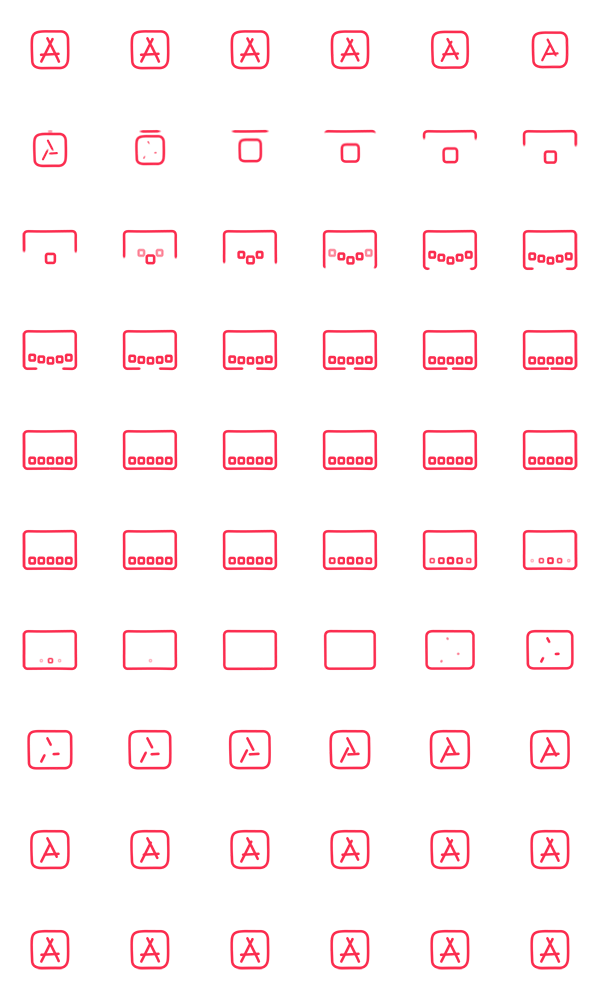

[](https://app.netlify.com/sites/transcendent-naiad-733465/deploys)

# 🍏 iPad

아이패드 제품 페이지를 만드는 예제입니다.

[DEMO](https://transcendent-naiad-733465.netlify.app/)


### Reset.css

각 브라우저의 기본 스타일을 초기화합니다.

```html
<link rel="stylesheet" href="https://cdn.jsdelivr.net/npm/reset-css@5.0.1/reset.min.css" />
```

### Google Fonts

Apple SF Pro 폰트는 공유 및 배포할 수 없기 때문에,  
가장 유사한 웹 폰트로 대체합니다.

영문: [Roboto](https://fonts.google.com/specimen/Roboto)
한글: [Noto Sans KR](https://fonts.google.com/noto/specimen/Noto+Sans+KR)

```html
<link rel="preconnect" href="https://fonts.googleapis.com">
<link rel="preconnect" href="https://fonts.gstatic.com" crossorigin>
<link href="https://fonts.googleapis.com/css2?family=Noto+Sans+KR:wght@400;700&family=Roboto:wght@400;500;700&display=swap" rel="stylesheet">
```

### 오픈 그래프 및 트위터 카드 정보

웹페이지가 소셜 미디어로 공유될 때 우선적으로 활용되는 정보를 지정합니다.

```html
<!--Open Graph-->
<meta property="og:type" content="website" />
<meta property="og:site_name" content="Apple (KR)" />
<meta property="og:title" content="iPad 10.2" />
<meta property="og:description" content="강력한 A13 Bionic 칩을 탑재한 iPad. 센터 스테이지 기술이 적용된 12MP 울트라 와이드 전면 카메라, True Tone 디스플레이 기술 및 64GB 저장 용량까지 갖췄습니다." />
<meta property="og:image" content="./images/ipad-seo.png" />
<meta property="og:url" content="https://www.apple.com/kr/ipad-10.2/" />

<!--Twitter Card-->
<meta property="twitter:card" content="summary" />
<meta property="twitter:site" content="Apple (KR)" />
<meta property="twitter:title" content="iPad 10.2" />
<meta property="twitter:description" content="강력한 A13 Bionic 칩을 탑재한 iPad. 센터 스테이지 기술이 적용된 12MP 울트라 와이드 전면 카메라, True Tone 디스플레이 기술 및 64GB 저장 용량까지 갖췄습니다." />
<meta property="twitter:image" content="./images/ipad-seo.png" />
<meta property="twitter:url" content="https://www.apple.com/kr/ipad-10.2/" />
```
### Sprite Icon Animation

여러 이미지를 한 이미지로 합쳐 관리하는 방식을 **이미지 스프라이트 기법** 이라고 합니다.



```css
@keyframes sprite-icon {
  /* 1~10 */
  0.00% { background-position: 0 0; }
  1.67% { background-position: -100px 0; }
  3.33% { background-position: -200px 0; }
  5.00% { background-position: -300px 0; }
  6.67% { background-position: -400px 0; }
  8.33% { background-position: -500px 0; }
  10.00% { background-position: 0 -100px; }
  11.67% { background-position: -100px -100px; }
  13.33% { background-position: -200px -100px; }
  15.00% { background-position: -300px -100px; }

  /* 11~20 */
  16.67% { background-position: -400px -100px; }
  18.33% { background-position: -500px -100px; }
  20.00% { background-position: 0 -200px; }
  21.67% { background-position: -100px -200px; }
  23.33% { background-position: -200px -200px; }
  25.00% { background-position: -300px -200px; }
  26.67% { background-position: -400px -200px; }
  28.33% { background-position: -500px -200px; }
  30.00% { background-position: 0 -300px; }
  31.67% { background-position: -100px -300px; }

  /* 21~30 */
  33.33% { background-position: -200px -300px; }
  35.00% { background-position: -300px -300px; }
  36.67% { background-position: -400px -300px; }
  38.33% { background-position: -500px -300px; }
  40.00% { background-position: 0 -400px; }
  41.67% { background-position: -100px -400px; }
  43.33% { background-position: -200px -400px; }
  45.00% { background-position: -300px -400px; }
  46.67% { background-position: -400px -400px; }
  48.33% { background-position: -500px -400px; }

  /* 31~40 */
  50.00% { background-position: 0 -500px; }
  51.67% { background-position: -100px -500px; }
  53.33% { background-position: -200px -500px; }
  55.00% { background-position: -300px -500px; }
  56.67% { background-position: -400px -500px; }
  58.33% { background-position: -500px -500px; }
  60.00% { background-position: 0 -600px; }
  61.67% { background-position: -100px -600px; }
  63.33% { background-position: -200px -600px; }
  65.00% { background-position: -300px -600px; }

  /* 41~50 */
  66.67% { background-position: -400px -600px; }
  68.33% { background-position: -500px -600px; }
  70.00% { background-position: 0 -700px; }
  71.67% { background-position: -100px -700px; }
  73.33% { background-position: -200px -700px; }
  75.00% { background-position: -300px -700px; }
  76.67% { background-position: -400px -700px; }
  78.33% { background-position: -500px -700px; }
  80.00% { background-position: 0 -800px; }
  81.67% { background-position: -100px -800px; }

  /* 51~60 */
  83.33% { background-position: -200px -800px; }
  85.00% { background-position: -300px -800px; }
  86.67% { background-position: -400px -800px; }
  88.33% { background-position: -500px -800px; }
  90.00% { background-position: 0 -900px; }
  91.67% { background-position: -100px -900px; }
  93.33% { background-position: -200px -900px; }
  95.00% { background-position: -300px -900px; }
  96.67% { background-position: -400px -900px; }
  98.33% { background-position: -500px -900px; }
}
```

JS로 각 프레임 위치 및 속성값 쉽게 만들기

```js
let x = 0
let y = 0
let frames = ''
for (let i = 0; i < 60; i += 1) {
  // frames += `${(100 / 60 * i).toFixed(2)}% { background-position: ${x}px ${y}px; }<br />` // HTML으로 출력!
  frames += `${(100 / 60 * i).toFixed(2)}% { background-position: ${x}${x === 0 ? '' : 'px'} ${y}${y === 0 ? '' : 'px'}; }\n`
  if (x <= -500) {
    x = 0
    y -= 100
    continue // 현재 반복을 종료하고 다음 반복으로 넘어가기!
  }
  x -= 100
}
// document.body.innerHTML = frames // HTML으로 출력!
console.log(frames)
```

### IntersectionObserver

[IntersectionObserver(요소의 가시성 관찰)](https://heropy.blog/2019/10/27/intersection-observer/)  
브라우저 뷰포트(Viewport)와 설정한 요소(Element)의 교차점을 관찰하여, 요소가 보이는지 보이지 않는지 구별하는 기능.

```js
// 요소의 가시성 관찰 로직!
const io = new IntersectionObserver(entries => {
  // entries는 `io.observe(el)`로 등록된 모든 관찰 대상 배열.
  entries.forEach(entry => {
     // 사라질 때.
    if (!entry.isIntersecting) {
      return
    }
    entry.target.classList.add('show')
  })
})
// 관찰할 요소들 검색
const infoEls = document.querySelectorAll('.info')
// 관찰 시작!
infoEls.forEach(el => io.observe(el))
```
